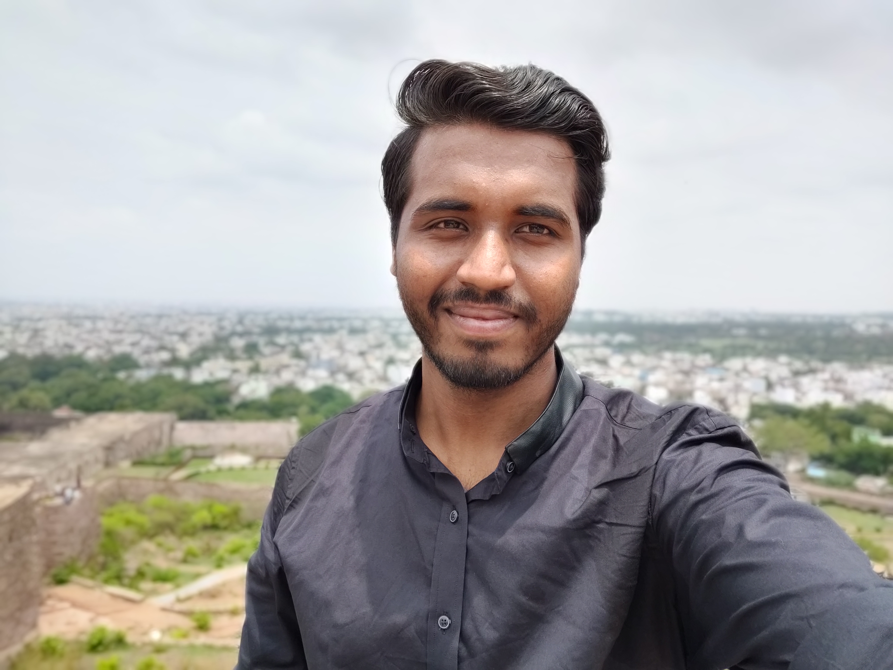

# RW_Android_BootCamp
Ray Wenderlich Android Boot-camp Project Repository.

## Profile

---

---

- **Name:** *Aditya Yadav*
- **Discord Username:** *TC: Aditya Yadav#6740*
- **Location:** *Mumbai, India*

---

I'm Aditya Yadav, currently doing my Master's in Computer Science from Thakur College of Science and Commerce, Mumbai. I'm interested in Coding and looking for an opportunity as a developer. I'm intermediate level Java Developer and currently exploring other programming languages such as Python, Kotlin, etc. I have interest in and currently learning Developing Mobile Apps and Machine Learning concepts. I love to share my knowledge and I occasionally conduct various sessions in my college. I enjoy attending various Tech Meetups in and around my city and in my spare time I love to travel, read books, play cricket, try mobile photography and at time watch movies.

---
